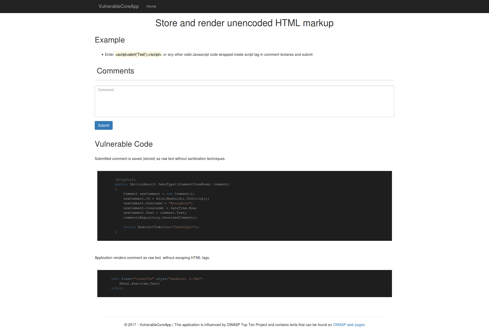
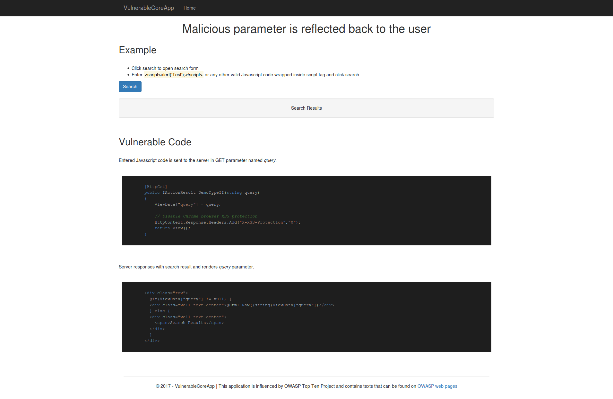

# Vulnerable ASP.NET Core 2.0 Web Application

The main idea behind this project is to show most common vulnerabilities that can be found in Web applications developed in ASP.NET Core framework. This application provides vulnerable code examples. You can use it as a reminder for writing secure code. There is possiblity that I didn't understand some vulnerablities, so don't trust this practical examples like they are valid references.

# Installation and setup

```shell
$ git clone https://github.com/zsusac/VulnerableCoreApp.git
$ cd VulnerableCoreApp/
$ dotnet run
```

Browse to http://localhost:5000

# Docker

Build with Docker:

```bash
docker build -t vulnerable-core-app .
docker run -d -p 5000:80 --name vulnerable-core-app vulnerable-core-app
```

Alternatively, you can build and run with Docker Compose:

```bash
docker-compose up -d
```

# Examples

## Stored XSS


## Reflected XSS


Pull requests and advices are always welcome.